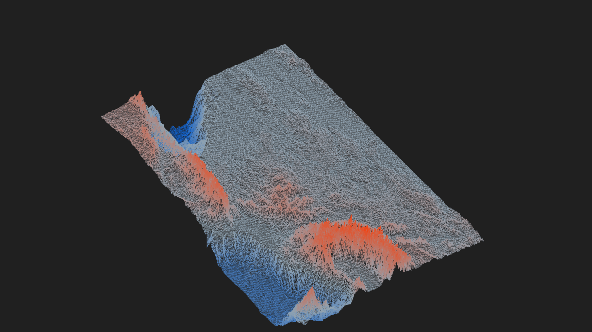
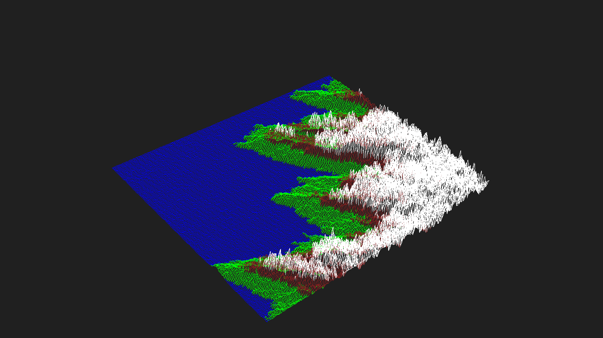
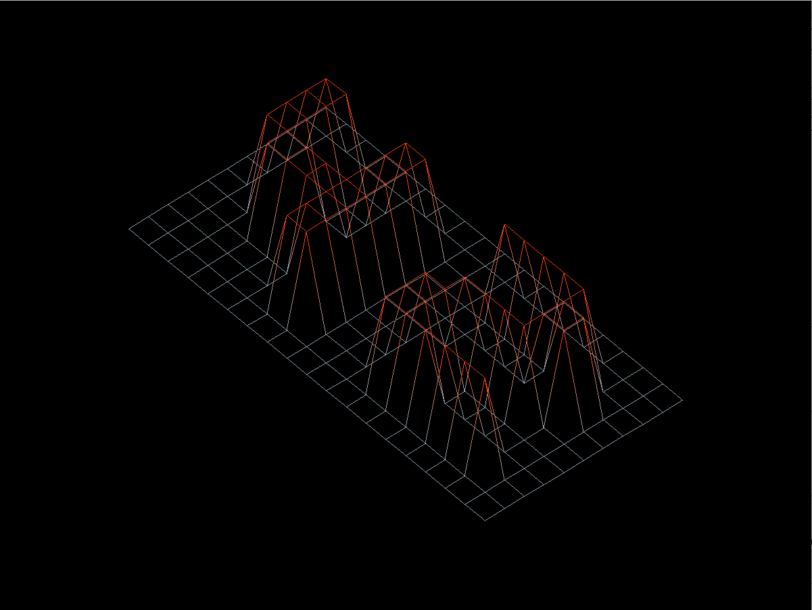

# 42FdF
<p align="center">
	
	
	
	
</p>

France.XXL.fdf

This is the first graphical project I've in the 42SP common core trail. It's objective is to print an isometric wireframe (or Fil-de-Fer) projection on screen from a map passed as an argument. In the mandatory part we are only required to draw it once on screen, but for the bonus part we also have to add the ability to rotate, translate and zoom in/out. So we need to keep updating the drawing in accordance to the transformations applied.

t1.fdf
## How to run
### 1. Clone the repository
 ```
 git clone git@github.com:rscres/42FdF.git
 cd 42Fdf
 ```
### 2.Compile
To compile the mandatory part
```
make
```
To compile the bonus part (with rotation, translation and zoom)
```
make bonus
```
### 3.Run
42.fdf

To run the program, simply type the executable name `./fdf` or `./fdf_bonus` and the map you want to see. Like this:
```
./fdf maps/42.fdf
or
./fdf_bonus maps/42.fdf
```
The 42.fdf map can be replaced with the desired map.
### Useful links
* [MinilibX](https://github.com/42Paris/minilibx-linux) the graphical library used in this project
